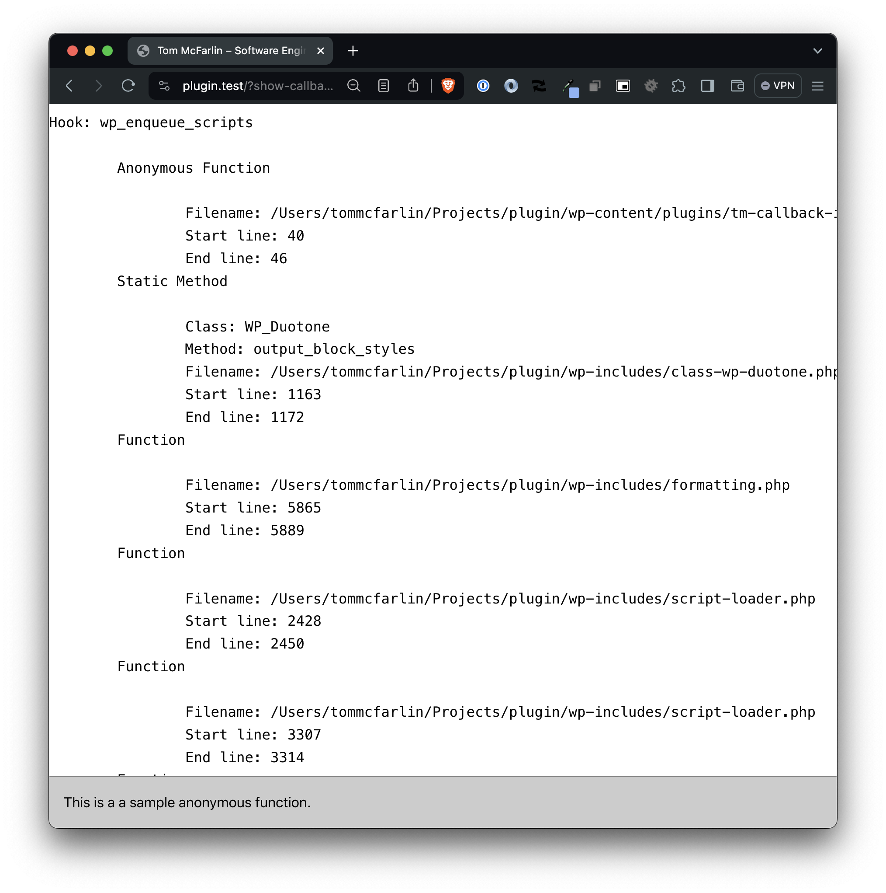

# Callback Info

Stable tag: 1.3.1
Requires at least: 3.1
Tested up to: 5.7
Requires PHP: 5.6
License: GPLv2 or later
Tags: rewrite rules, tools
Contributors: danielbachhuber, automattic, tmoorewp, GaryJ

**Stable tag:** 1.0.0 \
**Requires at least:** 6.5 \
**Tested up to:** 6.5.2 \
**Requires PHP:** 7.4 \
**License:** [GPLv3 or later](LICENSE) \
**Contributors:** [tommcfarlin](https://wordpress.org/plugins/tm-callback-info) \
**Tags:** developer, debug, tools \

This plugin renders contextual information about every function registered with all WordPress hooks.

## Description

This plugin renders contextual information about every function registered with all WordPress hooks. Specifically, this plugin will render:

- the name of the hook,
- the type of method (object, static, standard function, or anonymous),
- the file in which it's registered,
- the line on which the function starts,
- the line on which the function ends.

Callback Info was originally developed as a plugin to demonstrate certain concepts outlined in a series of blog posts. As the plugin became more advanced, I found it's functionality useful in my day-to-day work so decided to release it for others to use, too.
Originally developed for clients hosted at [WordPress VIP](https://wpvip.com/), we thought it would be useful for development environments, etc. too.

Pull Requests, Feedback, Questions, Bug Reports, and Feature Requests are welcome to be posted on the GitHub Issues page.

## Installation

### Install the Plugin From Within WordPress

1. Visit the Plugins page from your WordPress dashboard and click "Add New" at the top of the page.
1. Search for "callback-info" using the search bar on the right side.
1. Click "Install Now" to install the plugin.
1. After it's installed, click "Activate" to activate the plugin on your site.
1. Once installed, add `?show-callback-info=true` to your query string to render contextual information.

### Install the Plugin Manually

1. Download the plugin from WordPress.org or get the latest release from the [Github Releases page](https://github.com/tommcfarlin/tmn-callback-info/releases).
1. Unzip the downloaded archive.
1. Upload the entire `tm-callback-info` folder to your `/wp-content/plugins` directory.
1. Visit the Plugins page from your WordPress dashboard and look for the newly installed plugin.
1. Click "Activate" to activate the plugin on your site.
1. Once installed, add `?show-callback-info=true` to your query string to render contextual information.

## Screenshots

### 1. See which rewrite rules match a given URL, and the priorities they match in.

[missing image]

   

## Changelog

See the [changelog](https://github.com/tommcfarlin/tm-callback-info/blob/master/CHANGELOG.md).